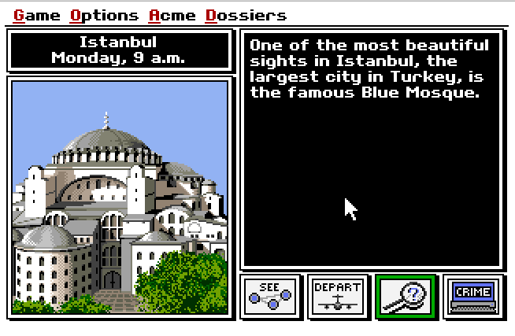

# Emscripten js-dos Games

Play old ms-dos games on your browser

[Play](http://humbertodias.github.io/emscripten-js-dos-games)

# Prerequires

1. Python

# Run

Clone

```
git clone https://github.com/humbertodias/emscripten-js-dos-games.git
```

Into 

```
cd emscripten-js-dos-games/
```

Server

```
python -m SimpleHTTPServer 9090
```

Open on your browser

```
open http://localhost:9090
```

# Output




# Tested Browser

Browser | Performance |
------------- | -------------
Firefox | Fast
Chrome | Fast
Safari | Slow
Opera | Normal
IE | Didn't try


# References

1. Emscripten

	[http://kripken.github.io/emscripten-site/](http://kripken.github.io/emscripten-site/)
	
2. js-dos

	[http://js-dos.com/games/](http://js-dos.com/games/)
