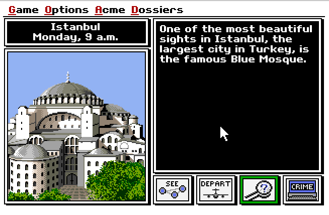

# Emscripten js-dos Games

Play old ms-dos games on your browser

# Run

Clone

```
git clone https://github.com/humbertodias/emscripten-js-dos-games.git
```

Into 

```
cd emscripten-js-dos-games/
```

Open on your browser

```
open index.html
```

# Output

